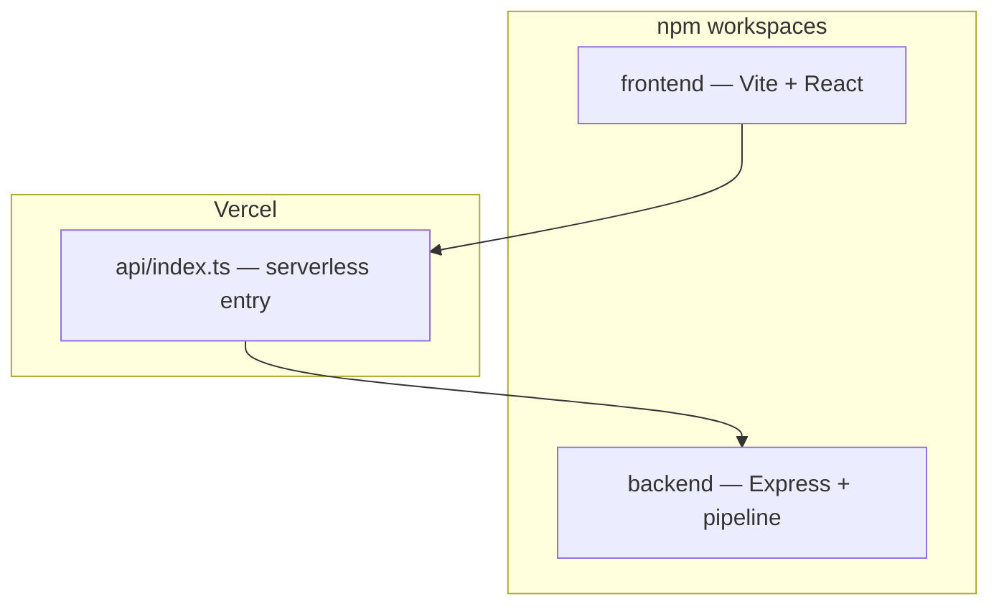
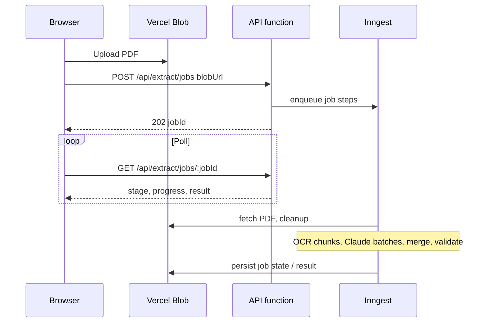

# System overview

High-level architecture for the PDF Extractor monorepo: browser UI, Vercel serverless API, object storage, and background work orchestration.

## Monorepo layout

- **frontend** — Dashboard, upload hook (`useExtraction`), D3 charts, export (JSON / CSV / PDF).
- **backend** — Express `app`, routes, extraction pipeline (`extraction/pipeline.ts`), services (blob, PDF, regex, Claude, OCR, validator).
- **api/index.ts** — Re-exports the Express app so all `/api/*` traffic runs in one function. See [Vercel deployment](../deployment/vercel.md).

## Production extraction path

For chunking, OCR, and accuracy layers, see [Large files and accuracy](../extraction/large-files-and-accuracy.md). For pipeline steps inside each stage, see [Extraction logic](../extraction/extraction-logic.md).

## Sync path (tests and short local runs)

`POST /api/extract` accepts a `blobUrl` and runs the pipeline in a single HTTP invocation. Suitable for integration tests and small PDFs; not the default for large files on serverless timeouts. Same validation and response shape as the async job result.

## Related

- [HTTP reference](../api/http-reference.md)
- [Vercel deployment](../deployment/vercel.md)
