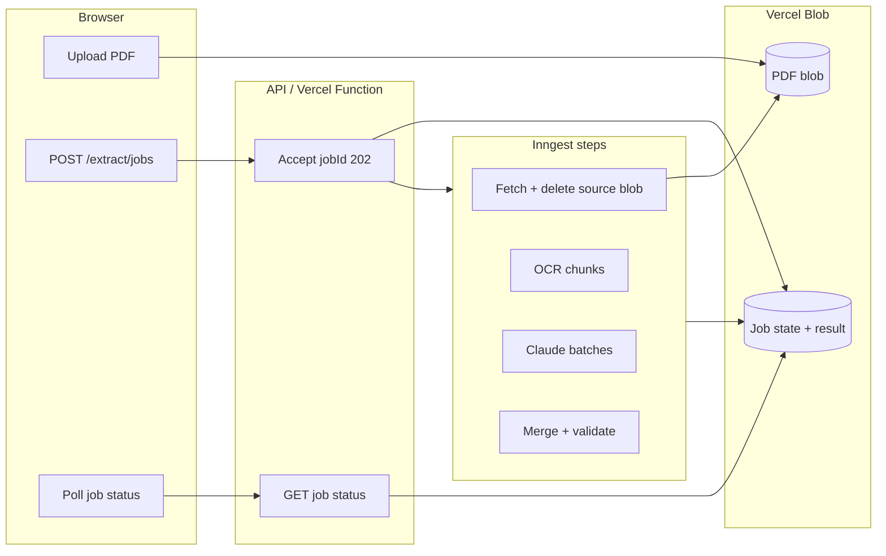
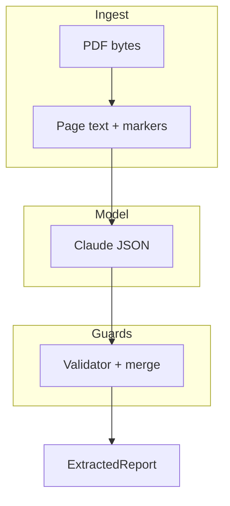

# Large PDF handling and accuracy (brief)

This note satisfies the assessment emphasis on **efficient large-PDF processing** (including 100MB-class files on serverless) and **technical judgment** (regex, LLMs, validation). For full pipeline detail see [Extraction logic](./extraction-logic.md).

---

## Large-file control (serverless–friendly)

**Problem:** Sending multi‑MB PDFs through a single API body hits platform limits; running OCR + LLM for hundreds of seconds in **one** HTTP invocation hits function timeouts.

**Approach:**

1. **Direct upload to object storage** — The browser uploads the file to **Vercel Blob**; the API receives only a short `blobUrl`. The PDF never passes through `express.json`, avoiding body-size limits and reducing API memory spikes.
2. **Async, durable jobs** — `POST /api/extract/jobs` returns immediately with a `jobId`. **Inngest** runs the pipeline as **separate steps** (fetch PDF, OCR in chunks, Claude per batch, merge/validate). Each step stays within **per-invocation** time limits (`maxDuration` in `vercel.json`).
3. **Chunked OCR** — Sparse or scan-heavy pages are OCR’d in configurable page batches so one function does not rasterize the entire document at once.
4. **Token-aware Claude batching** — When the annotated document exceeds an input token budget (or a max-pages-per-batch cap), the pipeline splits by **page ranges** and merges partial JSON reports deterministically.
5. **Cleanup** — The source upload blob is removed after the worker fetches the buffer, keeping temporary storage usage low.

---

## Accuracy (layered)

Aligned with evaluation criteria: **correct structure**, **reliable numerics**, **categorization**, **format variation**, and **zero false positives** for verbatim names where enforced.

| Layer | Role |
|-------|------|
| **Native PDF text** | `pdf-parse` with per-page assembly preserves reading order better than ad-hoc client rendering for tables/lists. |
| **OCR when needed** | Heuristics flag low-text pages; **Tesseract** fills gaps for scan-only plans so the model sees real content. |
| **Regex pre-annotation** | Deterministic `[NUM:…]` and `[SECTION:…]` markers reduce numeric hallucination and give stable section cues across PDF layout variants. |
| **Claude structured extraction** | Schema-grounded JSON from annotated text; optional **prompt caching** on the system block for repeated calls. |
| **Validation** | JSON shape checks; **source-grounded filtering** for names/titles; **recomputed summary stats** from filtered arrays so dashboards stay internally consistent. |

---

## Cross-references

- Pipeline steps (regex, prompts, validator internals): [Extraction logic](./extraction-logic.md)
- How accuracy was measured: [Accuracy testing](../quality/testing.md)
- Deploying Blob + Inngest for jobs: [Vercel deployment](../deployment/vercel.md)
